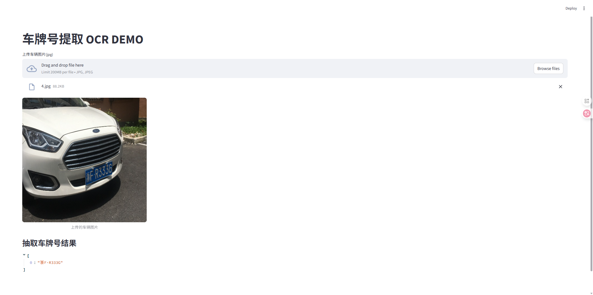

## Smart Gate Lever: 车牌自动识别与智能闸杆仿真系统
本系统是一套针对复杂工业环境设计的端到端（End-to-End）自动车牌识别解决方案。不同于传统的简单级联，本项目深度集成了目标检测前沿算法 YOLOv11n 与工业级文本识别引擎 PaddleOCR，并针对实际场景中的边缘形变、光照波动及识别角度偏移进行了专项优化，实现了从原始流媒体接入到结构化数据输出的高可靠全链路闭环。
# 核心技术技术栈
采用最新的 YOLOv11n 模型，通过在自定义车牌数据集上的迁移学习。引入了基于动态 Padding 的边界扩充算法，针对检测框边缘容易切割字符的问题，设计了自适应比例填充逻辑，显著提升了后续 OCR 环节的召回率。
采用 PP-OCRv4 核心架构，支持中文字符、字母及数字的混合高精识别。

